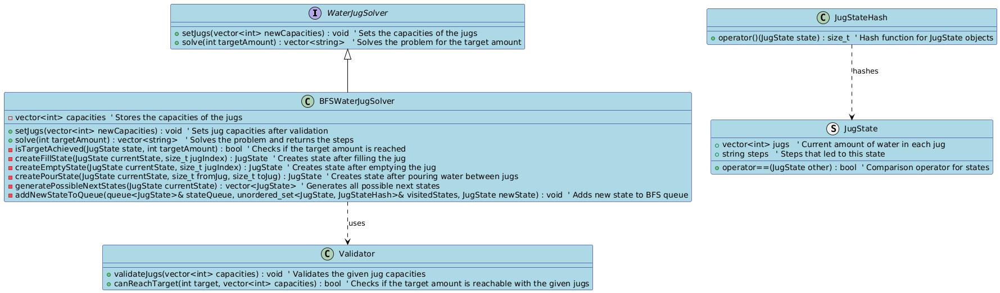
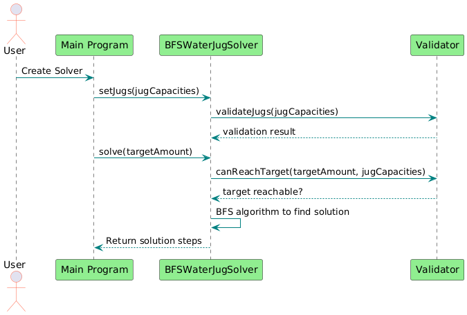
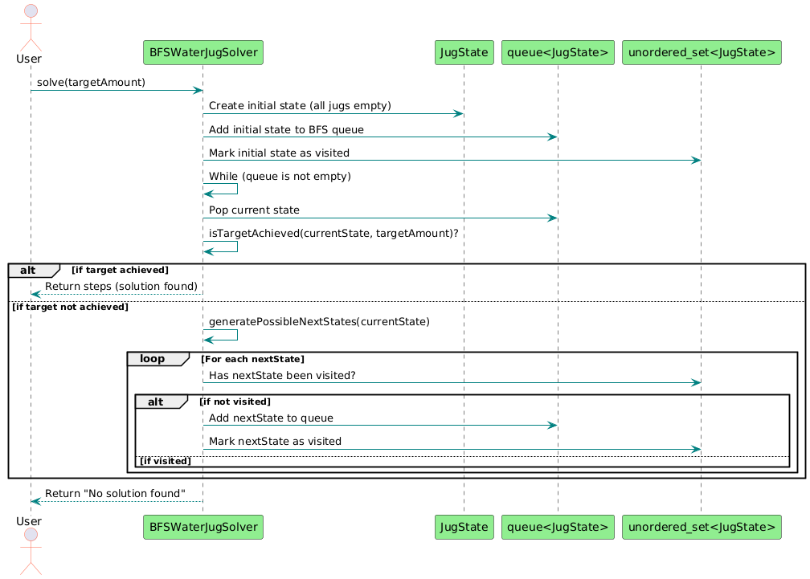

# Water Jug Problem Solver


## Project Overview

The **Water Jug Problem Solver** is an implementation of the well-known "Water Jug Problem" using the Breadth-First Search (BFS) algorithm. The program allows you to input jug capacities and a target amount of water, then it solves the problem by finding a sequence of steps to achieve the target amount using the given jugs. 

The project consists of:
- BFS-based solving algorithm (`BFSWaterJugSolver`)
- Jug state management (`JugState`)
- Input validation (`Validator`)
- Comprehensive unit testing using GoogleTest.

The project is built using **C++20** and utilizes modern C++ standards to ensure clean and efficient code. Testing is handled by **GoogleTest**, and CMake is used as the build system.

## Table of Contents

- [Installation](#installation)
  - [Build Requirements](#build-requirements)
  - [Build Instructions](#build-instructions)
- [Usage](#usage)
  - [Running the Program](#running-the-program)
  - [Solving the Problem](#solving-the-problem)
- [Testing](#testing)
  - [Running Unit Tests](#running-unit-tests)
- [Code Structure](#code-structure)
  - [Class Diagram](#class-diagram)
  - [Sequence Diagram](#sequence-diagram)
  - [BFS Algorithm Details](#bfs-algorithm-details)
- [Future Improvements](#future-improvements)

---

## Installation

### Build Requirements

To build this project nativr, you will need the following tools installed:

- **CMake** (version 3.8 or higher)
- **C++20** compatible compiler (e.g., GCC 10+, Clang 10+, MSVC)
- **GoogleTest** (automatically fetched by CMake)

	or

- **Docker** and **Docker Compose**

### Build Instructions

#### Native

1. Clone the repository:
   ```bash
   git clone https://github.com/your-username/water-jug-solver.git
   cd water-jug-solver 
   ```
2. Create a build directory:
   ```bash 
   mkdir build
   cd build
   ```
3. Run CMake to configure the project:
   ```bash 
   cmake ..
   ```
4. Build the project:
   ```bash 
   cmake --build .
   ```
 This will compile the solver and create executables for both the main program and the test cases.

 #### Via Docker compose

 1. Build Docker images:
   ```bash 
   docker-compose build
   ```

## Usage

### Running the Program

#### Native

After building the project, you can run the main executable:
   ```bash 
   ./water-and-jug
   ```

This will prompt you to enter the capacities of the jugs and the target amount of water to solve the problem.

 #### Via Docker compose

 1. Run the main executable via Docker:
   ```bash 
   docker-compose run run
   ```

### Solving the Problem
The program works by simulating the process of filling, emptying, and pouring water between jugs until the target amount is reached. If a solution is found, the program will output the sequence of steps to achieve the target. If no solution exists, it will inform you that the target is unreachable.

## Testing

### Running Unit Tests

#### Native

The project includes unit tests to validate the core components (Validator and BFSWaterJugSolver). 
To run the tests, execute the following command after building the project:
   ```bash 
   ctest
   ```
Alternatively, you can run individual test executables:
- For the Validator tests:
   ```bash 
   ./ValidatorTests
   ```
- For the BFSWaterJugSolver tests:
   ```bash 
   ./BFSWaterJugSolverTests
   ```

#### Via Docker compose

 1. Run unit tests via Docker compose:
   ```bash 
   docker-compose run test
   ```

## Code Structure

### Class Diagram
The following diagram illustrates the relationships between the classes and components of the project:


### Sequence Diagram
Below is the sequence of interactions when the user runs the program and requests to solve a water jug problem:


### BFS Algorithm Details
The BFS algorithm is used to explore all possible states of the jugs until a solution is found or all possibilities are exhausted. The detailed flow of the BFS algorithm is depicted below:


### Key Sections:
1. **Project Overview**: Describes the main purpose of the project, including its BFS-based solving algorithm and features.
2. **Installation**: Provides step-by-step instructions to clone, build, and run the project using CMake.
3. **Usage**: Details how to run the solver, including an explanation of how the BFS algorithm works to solve the Water Jug Problem.
4. **Testing**: Instructions on how to run the unit tests with `ctest` or individual test binaries.
5. **Code Structure**: Contains UML diagrams (class, sequence, and detailed BFS) with integrated PlantUML URLs to render the diagrams online.